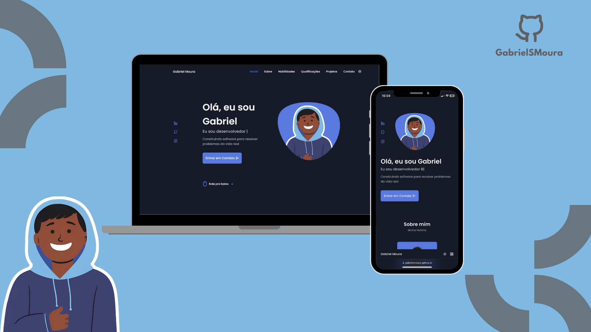

# 🌐 Gabriel Moura | Personal Portfolio



## 📖 Sobre o Projeto

Este repositório contém o código-fonte do meu portfólio pessoal, desenvolvido para apresentar minha trajetória, projetos, habilidades e experiências na área de desenvolvimento de software.

Atualmente sou estudante de **Desenvolvimento de Sistemas** na **FMU**, apaixonado por desenvolvimento web, tecnologia e projetos Open Source. Este site funciona como meu cartão de visitas na internet e reúne alguns dos projetos que desenvolvi durante minha jornada.

## 🚀 Acesse o Projeto

🔗 **Website:** https://gabrielsmoura.github.io/Web-Portfolio/

---

## 🛠️ Tecnologias Utilizadas

- HTML5
- CSS3
- JavaScript (ES6+)
- jQuery
- Swiper.js
- Typed.js
- Vanilla Tilt.js
- Font Awesome
- Unicons

---

## ✨ Funcionalidades

### 💬 Animação de Texto

Utiliza **Typed.js** para criar um efeito de digitação na apresentação inicial.

### 🎨 Interface Moderna

Layout limpo e intuitivo, desenvolvido com foco em experiência do usuário (UX).

### 📱 Design Responsivo

Compatível com dispositivos móveis, tablets e desktops.

### 🌙 Tema Claro/Escuro

Permite alternar entre os modos Light e Dark para maior conforto visual.

### 📂 Seção de Projetos

Os projetos são apresentados em um **slider responsivo** utilizando **Swiper.js**.

### 🎯 Efeitos de Interação

Elementos possuem animações e efeitos 3D utilizando **Vanilla Tilt.js**.

### ⬆️ Scroll to Top

Botão para retornar rapidamente ao topo da página.

```html
<a href="#" class="scrollup" id="scroll-up">
  <i class="uil uil-arrow-up scrollup_icon"></i>
</a>
```

---

## 📁 Estrutura do Projeto

```text
├── assets/
│   ├── css/
│   ├── img/
│   ├── js/
│   └── pdf/
├── index.html
└── README.md
```

---

## 💻 Executando Localmente

Clone o repositório:

```bash
git clone https://github.com/GabrielSMoura/Web-Portfolio.git
```

Entre na pasta do projeto:

```bash
cd Web-Portfolio
```

Abra o arquivo `index.html` no navegador ou utilize uma extensão como **Live Server** no VS Code.

---

## 📌 Objetivos

Este projeto foi desenvolvido para:

- Apresentar meu portfólio profissional;
- Compartilhar projetos desenvolvidos;
- Demonstrar conhecimentos em desenvolvimento Front-end;
- Servir como base para futuras melhorias e experimentações.

---

## 📬 Contato

- GitHub: https://github.com/GabrielSMoura
- LinkedIn: https://www.linkedin.com/in/gabrielsmoura

---

## 📄 Licença

Este projeto está licenciado sob a licença **MIT**. Sinta-se à vontade para utilizá-lo como inspiração para criar seu próprio portfólio.
